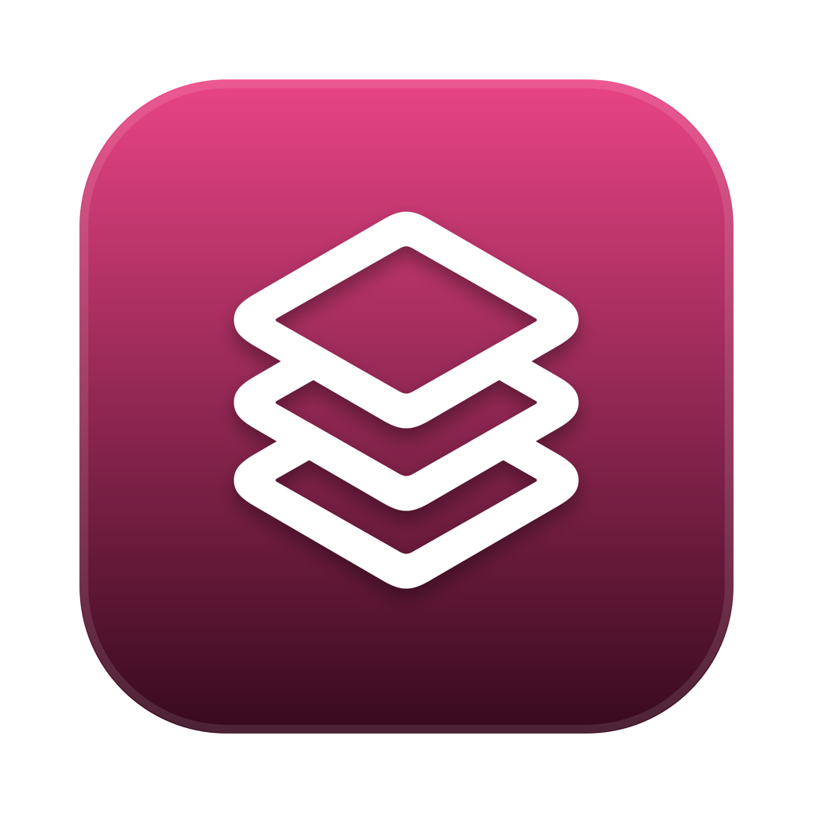

<h1 align="center">Multiapp</h1>

<p align="center">
  <b>Run several independent profiles of the same desktop app — separate logins, cookies and
  settings — without modifying, copying or re-signing the app.</b>
</p>

<p align="center">
  
  
  
  
  
  
  
</p>

<p align="center">
  <i>One flag does all the work: <code>--user-data-dir=&lt;dir&gt;</code>.
  No binary patching, no re-signing, and the credential store is never touched.</i>
</p>

---

<p align="center">
  
</p>

```console
$ multiapp new "Google Chrome" work
created Google Chrome/work
  ~/Library/Application Support/Multiapp/Profiles/Google Chrome/work
launch it:  multiapp launch "Google Chrome" "work"

$ multiapp launch "Google Chrome" work
launched Google Chrome/work

$ multiapp list
APP                PROFILE                STATE
Google Chrome      personal               stopped
Google Chrome      work                   running

$ multiapp stop "Google Chrome" work
Google Chrome/work stopped

$ multiapp list
APP                PROFILE                STATE
Google Chrome      personal               stopped
Google Chrome      work                   stopped
```

<p align="center">
  <sub>Not a mock-up — real output from <code>multiapp</code> against a real Chrome install. The
  author's own everyday Chrome was running throughout and was still running afterwards: profiles are
  matched on the whole <code>--user-data-dir</code> value, so stopping one never reaches another
  instance.</sub>
</p>

---

## Contents

- [What Multiapp is](#what-multiapp-is)
- [What Multiapp is not](#what-multiapp-is-not)
- [Features](#features)
- [How it works](#how-it-works)
- [Compatibility](#compatibility)
- [Project status](#project-status)
- [Installing](#installing)
- [Building from source](#building-from-source)
- [Repository layout](#repository-layout)
- [Testing](#testing)
- [Documentation](#documentation)
- [Roadmap](#roadmap)
- [Licence](#licence)

---

## What Multiapp is

Multiapp gives one installed application several independent identities. A second Claude account,
a work Notion beside a personal one, three Chrome profiles that are genuinely three browsers —
each with its own login, cookies, local storage and settings, all from the single copy of the app
already on your machine.

It also backs up and restores an app's real local data, and — separately, and much smaller — just
the **login session**, so that reinstalling an app does not mean signing in to everything again.

Three properties shape every decision in it:

**The app is never modified.** No binary patching, no re-signing, no injected libraries, no copied
bundles. Multiapp launches the app you already have with one extra command-line flag. That is the
whole mechanism, and it is why an app update never breaks a profile.

**Credential stores are never touched.** Multiapp does not read, write, export or decrypt anything
in the macOS Keychain or Windows Credential Manager. This is a deliberate limit with a visible
consequence — logins do not travel to another machine — and the tool says so rather than pretending
otherwise.

**A verdict has to be earned.** Every app in the compatibility table below was tested, and the ones
that do not work say why. Gemini is listed as unsupported because deleting every one of its session
files left it still signed in; that is a measurement, not an assumption.

## What Multiapp is not

It is **not a sandbox and not a security boundary.** Profiles run as the same user, with the same
Keychain and the same TCC permission grants. They isolate *sessions*, not *privileges*. A profile
will not stop a malicious app from reading another profile's files.

It is **not a way around licensing, subscription seat limits, account limits, authentication, app
integrity checks or terms of service.** Nothing here defeats a protection; it passes a documented
Chromium flag to an unmodified binary. Whether running two accounts is permitted is a question for
the service's terms, not for this tool.

It does **not work for every app** — see [Compatibility](#compatibility). Sandboxed apps, native
apps with no web layer, and apps that override their own data directory in code cannot be profiled
by any flag, and Multiapp reports those as unsupported rather than failing quietly.

---

## Features

### Working today

| | |
|---|---|
| **Profiles** | Create, launch, list, stop, clone, rename and delete isolated profiles of an installed app |
| **Discovery** | `scan` finds Electron/Chromium apps automatically, so apps installed later appear without a code change; natives and sandboxed apps are skipped with a reason |
| **Probing** | `probe` is a 10-second canary that launches an app and checks whether the flag was actually honoured, then records the verdict |
| **Launchers** | Clickable per-profile launchers — a macOS `.app` applet carrying the real app's icon, a Linux `.desktop` entry, a Windows Start-Menu shortcut |
| **Menu-bar app** | macOS AppKit status-bar UI over the CLI: profile list with live running state, launch/stop, rename/clone/delete, backup and restore, export/import, session transfer |
| **App backup** | Archive an app's real local data and restore it. Restores **merge** rather than replace, and anything they displace is staged to a recoverable Trash first |
| **Login sessions** | Save and restore just the login — kilobytes, not gigabytes — for any installed app, including ones that cannot be profiled at all |
| **Session reporting** | `session-check` shows what session data an app holds, which **sites** its cookies belong to, and whether any of it would survive a move to another Mac |
| **Claude Code sessions** | Copy chosen sessions between profiles as a true copy — new session ids and a duplicated transcript — because transcripts live outside the profile and sharing one is a live-session collision |
| **Portable core** | A Rust `multiapp-core` + `multiapp-cli` with `new · launch · list · stop · where`, one codebase for all three platforms |
| **Safety** | Type-to-confirm deletes, staged Trash instead of `rm`, a containment guard that refuses any path outside Multiapp's own root, and graceful quit that never force-kills |

### Designed and scheduled

A Tauri desktop GUI on the Rust core · the remaining commands ported to Rust · signed and notarised
macOS builds · a Windows installer · backup and session support on Windows.

See [`docs/ROADMAP.md`](docs/ROADMAP.md).

---

## How it works

```
┌──────────────────────────────────────────────────────────────┐
│  app/Multiapp.swift    macOS menu-bar UI (AppKit)             │
│                        a thin shell over the CLI              │
└───────────────────────────────┬──────────────────────────────┘
                                │ never touches profiles directly
┌───────────────────────────────▼──────────────────────────────┐
│  multiapp  (bash)      27 commands — profiles, backup,        │
│  multiapp.ps1          sessions, export/import, discovery     │
│  rust/  (portable)     new · launch · list · stop · where     │
└───────────────┬──────────────────────────────┬───────────────┘
┌───────────────▼──────────────┐ ┌─────────────▼───────────────┐
│  the launch lever            │ │  the data layer              │
│  --user-data-dir=<profile>   │ │  per-profile directories,    │
│  + `open -n` on macOS only   │ │  staged Trash, containment   │
└──────────────────────────────┘ └──────────────────────────────┘
                 │
┌────────────────▼─────────────────────────────────────────────┐
│  the unmodified application — launched, never altered         │
└──────────────────────────────────────────────────────────────┘
```

A few consequences worth stating plainly:

- **The equals form is mandatory.** `--user-data-dir=/path` works; `--user-data-dir /path` is
  silently ignored by Chromium's switch parser. That distinction cost a day to find and is now the
  single most important line in the codebase.
- **`open -n` is a macOS-only workaround.** Launch Services would otherwise focus the running copy
  instead of starting a second one. Windows and Linux have no such rule — running the binary again
  is enough.
- **`HOME` overrides do not work.** An early design assumed you could relocate an app by moving its
  home directory. Experiment E1b disproved it: on modern macOS the Cocoa and Chromium layers ignore
  `$HOME` entirely, and only POSIX and Node code paths follow it.
- **Profile matching is on the exact flag value.** A profile named `work` is a prefix of `work2`,
  and a substring match reports a stopped profile as running. Both the bash and Rust
  implementations compare the whole value, and there is a regression test pinning it.
- **Restores merge, never replace.** A cache-excluding archive is an *incomplete* copy of the
  directories it covers, and replacing with it deletes everything it skipped. This was found the
  hard way: a Telegram restore took 18,918 files down to 521.

---

## Compatibility

Verified on macOS. Every verdict below came from actually running the app.

| Status | Apps |
|---|---|
| **Supported** | Claude · Notion · Notion Calendar · GitHub Desktop · Visual Studio Code · Antigravity · Antigravity IDE · OpenMTP · Google Chrome |
| **Partial** | ChatGPT — data isolates, but the *account* is shared across profiles because the identity lives in the Keychain. Do not sign out inside a profile. |
| **Unsupported** | Gemini and ChatGPT Classic (native, no isolation lever) · Telegram for macOS (sandboxed — its container is keyed to the bundle id and cannot be redirected) · Telegram Desktop (not Electron) · HDRezka-Client (overrides its own `userData` path in code, so the flag is ignored) |
| **Untested** | anything `scan` discovers — run `multiapp probe <app>` and it records the result |

Backup and login-session commands work for **any** installed app that holds a session, including
every app in the unsupported row.

---

## Project status

Working and in daily use on macOS. Windows and Linux are implemented but **unproven on real
hardware**.

| Area | State |
|---|---|
| Profiles, discovery, probing, launchers (macOS) | Complete |
| macOS menu-bar app and signed DMG | Complete (ad-hoc signed) |
| App backup and restore | Complete |
| Login-session save and restore | Complete |
| Export / import of any app's local data | Complete |
| Rust portable core and CLI | `new · launch · list · stop · where` complete — **verified by CI on Windows and Linux** |
| Windows (`multiapp.ps1`) | Profile commands only, **never executed on Windows** |
| Linux (`multiapp` bash) | Implemented from verified patterns, **never executed on Linux** |
| Cross-platform CI | Green on Windows and Linux; skips the GUI test on macOS runners — see below |
| Tauri GUI | Not started |

**What is actually verified, and by what.** The Rust CLI is exercised on every push by a CI job that
launches a real Chromium app, asserts it wrote into the isolated profile, asserts a prefix-named
sibling profile is *not* reported as running, and asserts graceful stop works:

| Runner | App driven | Result |
|---|---|---|
| `windows-latest` | Edge, `C:\Program Files (x86)\Microsoft\Edge\Application\msedge.exe` | passes — including graceful stop via `taskkill` without `/F` |
| `ubuntu-latest` | Chrome, `/usr/bin/google-chrome`, headless | passes |
| `macos-latest` | — | **skipped**, see below |

The macOS job cannot run it. macOS launches through LaunchServices (`open -n`), which needs a usable
window server, and GitHub's macOS runners do not have one — `open` blocks there instead of failing,
which cost one CI run a ten-minute hang before it was diagnosed. Detecting the condition was itself
misleading: those runners report `launchctl managername` as **Aqua**, so the obvious check passed and
the test failed anyway. The test now simply skips on macOS under CI and says why. Nothing is lost by
that, because macOS is the one platform verified on a real desktop on every change; CI exists here to
reach Windows and Linux, which the development machine cannot.

That hang also produced a product fix: `launch()` no longer waits on `open` indefinitely. It gives up
after 30 seconds and reports a stuck LaunchServices, which a user with a wedged window server would
have wanted too.

**Tested on a real Windows machine, not only CI.** A Windows 11 VM ran the shipped `multiapp.exe`
and confirmed: the profile directory is written, the profile is reported as running, and a
prefix-named sibling (`work` vs `work2`) is correctly reported as stopped. Two bugs came out of it
that CI could not have found, both in `launch`:

- the child inherited multiapp's stdio, so the browser held its launcher's handles — over SSH that
  hung the connection for ten minutes;
- nulling the stdio was not enough, because on Windows a child stays attached to its parent's
  **console** and a shell waits on that console's process tree. `DETACHED_PROCESS` fixed it.

**One thing remains genuinely unresolved: graceful `stop` on an interactive Windows desktop.**
`taskkill` without `/F` posts `WM_CLOSE` to a process's top-level windows. A browser launched over
SSH has none — an SSH session runs in a separate window station — so stop cannot work there, and
`MainWindowHandle` read over SSH always reads 0 even when a window exists, which makes the condition
unmeasurable remotely too. The CI job's stop assertion passes, but for the same reason it is not
evidence about a normal desktop. Running `scripts/test-windows.ps1` from a real desktop session is
what will settle it; until then, treat Windows `stop` as unverified. multiapp never force-kills, so
the failure mode is a message telling you to quit the app yourself — not lost data.

Two further limits. What CI verifies is the **Rust** CLI — the bash tool with its 27 commands is
macOS-only in practice and has no automated suite. And `multiapp.ps1` is a separate implementation
that **does not parse under PowerShell**: its first execution ever, on that same VM, failed at
`multiapp.ps1:186` with "The '<' operator is reserved for future use". It has never worked, and the
README should not have implied otherwise.

---

## Installing

**macOS.** Download the DMG from [Releases](../../releases), drag Multiapp to Applications, then
right-click → **Open** → **Open** on first launch (the build is ad-hoc signed, so Gatekeeper warns
once). For the CLI:

```bash
./multiapp install-stub
```

That puts a small self-locating stub on your `PATH`. The stub records where the real script lives
and re-finds it through the OS file index if the folder is ever moved, so moving or renaming the
project directory does not break the command.

**Windows.** No build step and no installer — `multiapp.ps1` runs on the PowerShell already in
Windows. Read [`WINDOWS.md`](WINDOWS.md) first; it lists what is
implemented and what has never been exercised.

```powershell
powershell -ExecutionPolicy Bypass -File .\multiapp.ps1 doctor
```

---

## Building from source

Only the Rust core and the macOS app have a build step.

```bash
cd rust && cargo build --release
```

```bash
bash app/build.sh
```

The first produces `multiapp` (or `multiapp.exe`); the second builds the macOS menu-bar app with
plain `swiftc` — no Xcode project — installs it to `~/Applications`, and lays out a DMG.

---

## Repository layout

```
multiapp                 the macOS/Linux CLI — 27 commands, one bash file
multiapp.ps1             the Windows CLI — profile commands only, unproven
app/Multiapp.swift       macOS menu-bar application (AppKit)
app/build.sh             swiftc build + DMG layout, no Xcode required
app/make-assets.swift    icon and DMG background, drawn with CoreGraphics
rust/crates/multiapp-core   paths, process matching, launching, profiles
rust/crates/multiapp-cli    the portable command-line front end
docs/                    research report, roadmap, experiment results
scripts/test-windows.ps1 one-command Windows verification run
.github/workflows/ci.yml build + real-app integration tests on all three OSes
```

## Testing

```bash
cd rust && cargo test
```

Nine tests: eight unit tests covering the prefix-collision guard, name validation, the containment
guard, the environment override and the on-disk layout — plus one integration test that drives a
**real Chromium app**. That test launches it into a throwaway profile, waits for the app to write
there, confirms the process is found by profile, confirms a prefix-named sibling is not, and stops
it gracefully. It skips rather than fails where no such app is installed.

The bash CLI has no automated suite; its verdicts come from the experiment logs in
[`docs/experiments/`](docs/experiments/), which record what was actually run and observed.

## Documentation

`docs/` is the evidence base, not a summary written afterwards.

| File | What it holds |
|---|---|
| [`REPORT.md`](docs/REPORT.md) | The full technical design report — mechanisms, alternatives, compatibility analysis, risk register, and every conclusion labelled as verified, inferred, or unknown |
| [`MULTIGRAVITY-ANALYSIS.md`](docs/MULTIGRAVITY-ANALYSIS.md) | Source-level analysis of the reference project this work started from, read from its actual files rather than its README |
| [`ROADMAP.md`](docs/ROADMAP.md) | Milestones and their sequence |
| [`BACKUP-MIGRATE-SPEC.md`](docs/BACKUP-MIGRATE-SPEC.md) | What can and cannot be migrated between machines, and why |
| [`../WINDOWS.md`](WINDOWS.md) | Honest state of the Windows port |
| [`experiments/`](docs/experiments/) | E1–E12 — the raw results, including the ones that disproved the original design |

The experiments are the file to read first. They record what was measured, including the cases
where a measurement contradicted the assumption and the design had to change — the `HOME` override
that turned out to do nothing, and the session files whose deletion left an app still signed in.

## Roadmap

| Milestone | State |
|---|---|
| Verified isolation mechanism and macOS CLI | Complete |
| macOS menu-bar app and DMG | Complete |
| Backup, restore and login sessions | Complete |
| Portable Rust core and CLI | Complete |
| **CI green on Windows and Linux** | **Next** |
| Remaining commands ported to Rust | Planned |
| Tauri GUI on the shared core | Planned |
| Signed and notarised macOS build, Windows installer | Planned |

---

## Licence

**MIT** — see [`LICENSE`](LICENSE). Use it, fork it, ship it.

Multiapp is an independent project. It is not affiliated with or endorsed by any of the
applications it launches, and their names are used only to describe compatibility. It contains no
code taken from them, modifies none of them, and circumvents no protection in any of them: it
passes a documented Chromium command-line flag to a binary it leaves untouched.

Backup archives produced by this tool can contain live session data. **Treat them like passwords.**

---

<p align="center"><sub>Built in Tashkent, Uzbekistan</sub></p>
