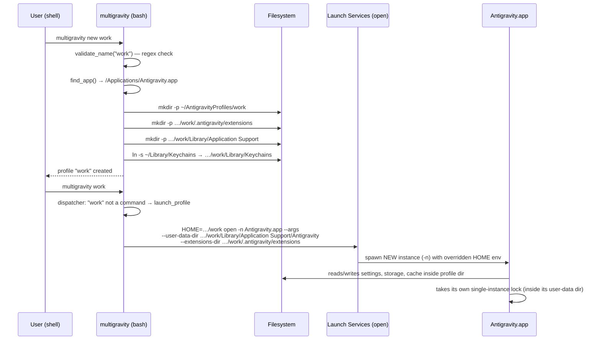

# Multiapp — macOS Multi-Profile Application Launcher
## Research, Feasibility, and Architecture Design Report

**Product name:** Multiapp (chosen in the spirit of "multigravity"; folder renamed "App cloner" → "Multiapp" on 2026-07-17)
**Status:** Research phase — Phase 0 experiments E1 + E2-core already executed (see update box below and `experiments/E1-results.md`)
**Date:** 2026-07-15

> ### ⚡ Phase 0 Update (2026-07-15, same day) — E1/E2-core results revise this report
> 1. ✅ `open -n` **does** propagate custom env (verified with a probe app; ppid=1 → true Launch Services spawn).
> 2. ❌ **But `HOME` override is the wrong lever on macOS 26:** `NSHomeDirectory()`, `NSSearchPathForDirectoriesInDomains`, and Electron's `app.getPath('userData')` all **ignore `$HOME`** (verified with Swift + real Electron probes). Only POSIX `getenv` / Node `os.homedir()` follow it. Multigravity's macOS `HOME` trick is largely vestigial — its real isolation comes from the VS Code flags.
> 3. ✅ **Modern Electron honors `--user-data-dir=` at core level** (verified on Electron 43.1.1 and on **Claude.app**, bundled Electron 42.5.1). **The flagship use case is now fully verified (E2+E3-core, same day): two Claude accounts logged in simultaneously in separate profiles, and the second account's session survived quit+relaunch** (safeStorage decrypted via the single shared "Claude Safe Storage" keychain key; no Keychains symlink, no env overrides — E5 settled too). Equals form required — `--user-data-dir=/path`; the space-separated form is ignored by Chromium parsing.
> 4. ~~Old Electron ignores the flag → version gate~~ **Corrected by E11 (same day):** the flag is honored across Electron 18→43 (8-app sweep: OpenMTP 18 ✅ … Claude 42.5 ✅); the one failure (HDRezka, Electron 22) is an **app-specific `app.setPath('userData')` override** 🟡, not a version floor. Rule: flag is the default mechanism for all Electron apps, but a dynamic canary probe is mandatory — no static version gate is reliable.
> 5. ⬇ **ChatGPT/Gemini (native) downgraded:** with Foundation ignoring `$HOME`, there is no generic env lever for native-app data at all → "unsupported by redirection" unless app-specific flags exist; the long-term hard-isolation tier gains importance.
>
> Sections below have been revised where load-bearing; `experiments/E1-results.md` holds the full evidence.
**Reference implementation analyzed:** [sujitagarwal/multigravity-cli](https://github.com/sujitagarwal/multigravity-cli)
**Evidence appendix:** `multigravity-source-analysis.md` (full source-verified analysis with code quotes)

**Evidence labels used throughout:**
🟢 *Verified from source code* · 🔵 *Verified from official platform documentation* (or local system inspection on this Mac) · 🟡 *Reasoned inference* · 🟠 *Requires experiment* · ⚪ *Unknown*

---

## 1. Executive Summary

Multigravity-cli proves that on macOS a Chromium/VS Code-lineage application can be multiplied into
independent, concurrently running profiles **without copying, modifying, or re-signing the application
binary**. It does this with three cheap, official mechanisms: overriding `HOME` to a per-profile
directory, passing the app's own `--user-data-dir`/`--extensions-dir` flags, and launching with
`open -n` to force a new process instance (🟢).

The general concept **transfers to macOS for a meaningful class of applications, but not universally**.
Local inspection of real targets on this machine (🔵) shows the landscape splits cleanly:

- **Electron, non-sandboxed apps** (Claude `com.anthropic.claudefordesktop`, Notion `notion.id`,
  Antigravity `com.google.antigravity`) — isolate via `--user-data-dir=<dir>` (equals form), which
  modern Electron honors at core level (**verified live on Claude same day**: fresh profile, two
  concurrent instances, no leakage); VS Code-family apps additionally accept official flags. Best-
  supported category. Old Electron (≲36) ignores the flag (verified on Electron 22).
- **Native, non-sandboxed apps** (ChatGPT `com.openai.codex` — native Swift, sandbox entitlement
  explicitly `false`; Gemini `com.google.GeminiMacOS` — native, sandbox `false`) — **no generic lever
  on macOS 26**: E1b proved Foundation's path APIs ignore `$HOME`, and authentication living in
  **Keychain** (ChatGPT's `2DC432GLL2.*` access group) is keyed to the app's code signature anyway.
  Unsupported by redirection; candidates for the long-term hard-isolation tier.
- **Sandboxed apps** (Telegram `ru.keepcoder.Telegram`, sandbox `true`) — the sandbox assigns one
  container per bundle ID per user; `HOME` redirection cannot move it. **Not supportable without
  modifying the bundle or using OS-level isolation.**

Three architectures were compared: **(A)** a profile-aware launcher with per-app adapters (multigravity
generalized), **(B)** bundle cloning with re-signing, **(C)** OS-level isolation (separate macOS users /
VMs). The recommended **MVP is Architecture A** — it touches no third-party binary, uses only official
mechanisms, carries the lowest legal and security risk, and covers the most valuable targets (Claude,
Antigravity, VS Code forks, generic Electron apps). The recommended **long-term architecture is A
extended with a compatibility-detection engine and an optional VM-backed "hard isolation" tier** for
apps A cannot serve; bundle re-signing (B) is rejected as a default because it breaks notarization,
auto-update, and Keychain access, and raises ToS/licensing risk.

The report defines the adapter system, profile lifecycle, storage model, Keychain strategy (share the
login Keychain by design, never extract secrets), a phased roadmap with testable acceptance criteria,
and a risk register. The single most important open risk: **per-app behavior under `HOME` override is
empirically unknowable without experiments** — the PoC phase exists precisely to convert 🟡/🟠 claims
into verified facts before any product commitment.

---

## 2. What Multigravity Actually Does

🟢 *Verified from source code* (all statements in this section; see appendix for quotes).

Multigravity-cli is a **pure bash CLI (~800 lines) with a PowerShell port** — no Node, no Python, no
compiled binary. It manages named profiles of Google's Antigravity IDE under
`$HOME/AntigravityProfiles/<name>` (overridable via `MULTIGRAVITY_HOME`).

What it does **not** do is as important as what it does:

| Mechanism | Used? | Evidence |
|---|---|---|
| Duplicate the application binary/bundle | **No** | `find_app()` locates the existing install; launch invokes it directly |
| Modify Antigravity's bundle identifier | **No** | The only `CFBundleIdentifier` written is on Multigravity's own wrapper `.app` shortcuts (`com.multigravity.profile.<name>`) |
| Re-sign or patch anything | **No** | No `codesign` invocation anywhere |
| Redirect user-data directories | **Yes** | `--user-data-dir` + `--extensions-dir` flags pointed inside the profile dir |
| Override environment variables | **Yes** | `HOME` (macOS), `HOME`+`XDG_*` (Linux), `USERPROFILE`/`APPDATA`/`LOCALAPPDATA` (Windows) |
| Create launch wrappers | **Yes** | Generated `.app` bundles (macOS), `.desktop` files (Linux), `.lnk` shortcuts (Windows) that re-enter the CLI |
| Use symbolic links | **Yes** | macOS Keychains dir symlinked into each profile (shared); `--shared` profiles symlink settings/extensions from the system install |
| Copy configuration directories | **Only for** `clone`/`--from <template>` (plain `cp -R`) |

**Isolated per profile:** the entire user-data dir (settings, global/workspace storage, account state),
extensions dir, and everything the app writes relative to the overridden `HOME`.
**Shared always:** the app binary and, deliberately, the macOS login Keychain (symlink).
**Shared in `--shared` profiles:** extensions + `settings.json`/`keybindings.json`/`snippets`
(symlinked read/write to the system install — edits propagate back).

**Why multiple Antigravity processes can run concurrently:** the VS Code/Chromium single-instance lock
lives inside the user-data dir, so distinct `--user-data-dir` values mean distinct locks (🟡 inferred —
no lock file is touched in the code); and `open -n` forces macOS to spawn a new instance instead of
activating the existing one (🔵 `man open`).

---

## 3. Verified Repository Architecture

🟢 Repository file map (10 tracked files; tree fetched with `recursive=1`, `"truncated": false`):

| File | Responsibility |
|---|---|
| `multigravity` | Main CLI (bash, macOS+Linux): platform detection, app discovery, profile CRUD, launch, templates, export/import, doctor, self-update, completion |
| `multigravity.ps1` | Windows port of the same command surface (env-var-only isolation) |
| `install.sh` | `curl \| bash` installer → `/usr/local/bin` (fallback `~/.local/bin` + PATH patch) |
| `install.ps1` | Windows installer → `%USERPROFILE%\.local\bin` + `.cmd` shim + User PATH |
| `uninstall.sh` / `uninstall.ps1` | Remove binary, shortcuts, and (after confirm) all profile data |
| `README.md` | Docs; minor divergences from code (see §7 of appendix) |
| `.gitignore` | Excludes `test.sh` (tests not in repo — coverage uninspectable) |
| `icon.icns`, `assets/multigravity-logo.jpg` | Binary assets (not inspected) |

Internal structure of the main script: constants (`BASE`) → helpers (`platform`, `find_app`,
`profile_dir`, `user_data_dir`, `extensions_dir`, `validate_name`) → layout builders
(`create_profile_layout`, `create_shared_layout`) → `launch_profile` → lifecycle commands → a `case`
dispatcher where an unrecognized first argument is treated as a profile name to launch.

Notable engineering properties: `set -euo pipefail`; name validation regex
`^[a-zA-Z0-9][a-zA-Z0-9-]*$` blocks path traversal; `delete` requires y/N confirmation but
`template delete` does not; `import` extracts archives without path-traversal sanitization (a defect
our design must not inherit); atomic self-update via `.tmp` + `mv`.

---

## 4. End-to-End Execution Flow

Sequence for `multigravity new work` followed by `multigravity work` on macOS (🟢):



Deletion flow: `delete <name>` → y/N prompt → `rm -rf` profile dir → remove wrapper shortcut.
Export/import: `tar -czf` of the profile dir / extraction into `$BASE` (unsanitized — see §22).

---

## 5. Profile and Data-Isolation Mechanism

The isolation stack, from strongest to weakest guarantee:

1. **App-honored CLI flags** (`--user-data-dir`, `--extensions-dir`) — 🟢 passed by multigravity;
   🟡 that Antigravity honors them is inferred from VS Code lineage. When honored, this is the most
   precise mechanism: the app itself relocates its state, including its single-instance lock.
2. **`HOME` environment override** — 🟢 used by multigravity, but **E1b (🔵 verified on macOS 26 /
   Darwin 25.5) showed it is far weaker than assumed**: `NSHomeDirectory()`,
   `homeDirectoryForCurrentUser`, `NSSearchPathForDirectoriesInDomains` (i.e. `~/Library/Application
   Support` resolution), and Electron's `app.getPath('userData')` all **ignore `$HOME`** and resolve
   via the user record (`CFCopyHomeDirectoryURL` is even marked unavailable in the current SDK). Only
   POSIX `getenv("HOME")` and Node/libuv `os.homedir()` follow the override — so it moves dotfiles and
   Node-layer paths, nothing Cocoa/Chromium-layer. `cfprefsd` preferences and Keychain access follow
   the user session regardless. **Conclusion: on modern macOS the flag (item 1) does the isolation;
   `HOME` is a supplement for dotfiles only.**
3. **Process-level instance forcing** (`open -n`) — 🔵 documented; necessary but not sufficient (an
   app can still detect a sibling via its own lock/mach service and quit).

**What escapes this isolation model entirely** (🔵 platform behavior):
- **Keychain items** — stored in the user's keychain DB, gated by code-signing identity and keychain
  access groups (ChatGPT: `2DC432GLL2.*`; Claude: WebAuthn/hwkey/Microsoft-SSO groups — 🔵 read from
  entitlements on this Mac). `HOME` has no effect; multigravity embraces this by symlinking Keychains.
- **Sandbox containers** — assigned per bundle-ID by `containermanagerd`; the sandbox rewrites the
  app's view of `HOME` to the container itself. External `HOME` overrides are ignored (🔵/🟡).
- **`defaults`/`CFPreferences` domains** — mediated by `cfprefsd`, keyed by bundle ID per user; two
  profiles share one preferences domain unless the app only uses file-based config (🔵/🟠 —
  empirically many Electron apps keep almost everything in their user-data dir, so impact is low).
- **TCC permission grants** (mic, camera, screen recording) — keyed by bundle ID per user; shared
  across profiles (🔵). Usually desirable (grant once), but it means profiles are not privacy-isolated
  from each other.
- **Push notification registration, deep-link (URL scheme) handlers, file associations, Launch
  Services registration** — all keyed on bundle ID; all profiles of one app look identical to the OS (🔵).

**Conclusion:** multigravity's model isolates *file-backed application state* and deliberately shares
*OS-level identity* (signature, bundle ID, Keychain, TCC). That trade-off is what makes it safe and
legal — and it defines the boundary our product inherits with Architecture A.

---

## 6. What Can and Cannot Transfer to macOS

The reference project already runs on macOS, so the question is transferring the *concept* from
"one known IDE" to "arbitrary applications."

**Transfers directly (🟢/🔵):**
- `HOME` override + per-profile directory trees + `open -n` — app-agnostic mechanisms.
- Wrapper `.app` shortcuts per profile (own bundle ID `com.<product>.profile.<name>`), enabling Dock
  pinning and per-profile icons — with the caveat that all wrappers launching the same real app share
  that app's Dock identity once running (⚪ exact Dock grouping behavior varies; requires experiment).
- Profile lifecycle (create/clone/template/export/import/delete) — pure file operations.

**Transfers only per-app (revised after E1):**
- CLI flags: Electron's official command-line-switches docs do not list `--user-data-dir`, **but E1c
  proved modern Electron honors it at core level** (🔵 empirically: Electron 43.1.1 and Claude's
  bundled 42.5.1 both honor `--user-data-dir=/path`; Electron 22 ignores it — version floor ~36 🟡).
  **Equals form is mandatory** — Chromium switch parsing ignores the space-separated form (🔵 verified
  both ways against Claude.app). Chromium browsers honor it natively (🔵); VS Code forks parse both
  forms in their own CLI layer (🟢 multigravity relies on this). So: VS Code forks ✅, Chromium
  browsers ✅, **modern Electron ✅ via the flag (equals form)**, old Electron ❌, native apps ❌
  unless they document their own flag.
- `HOME`-override — 🔵 verified largely ineffective on macOS 26 (§5 item 2); useful only for
  Node-layer dotfiles, so it demotes from primary mechanism to supplement.

**Does not transfer (🔵/🟡):**
- Sandboxed apps (containers are bundle-ID-keyed; no env override can split them).
- Keychain-resident auth state (shared per app signature across all profiles).
- Apps that enforce single-instance via bundle-ID-keyed mach services or named semaphores rather than
  a file lock in a redirectable directory (🟠 per app).
- The Linux/Windows halves of multigravity — out of scope but instructive: they prove the same concept
  needs *platform-specific* redirection primitives, which is what our adapter layer generalizes.

---

## 7. macOS Application Data and Security Model

Reference model the product must respect (all 🔵 unless noted):

| Mechanism | Key facts for this product |
|---|---|
| **App bundles** | Self-contained `.app` directories; identity = `CFBundleIdentifier` + code signature. Copying a bundle does **not** copy or isolate its user data (data lives under `~/Library`), and a copy with the same bundle ID still maps to the same containers/preferences/TCC records. |
| **Launch Services** | Registers apps by bundle ID; `open` activates the running instance unless `-n`. `LSMultipleInstancesProhibited` in Info.plist declares single-instance intent (checkable during compatibility detection). |
| **User-domain data dirs** | `~/Library/Application Support/<name or bundle-id>`, `~/Library/Caches/<bundle-id>`, `~/Library/Preferences/<bundle-id>.plist`, `~/Library/Saved Application State/<bundle-id>.savedState`, `~/Library/WebKit/<bundle-id>`, `~/Library/HTTPStorages/<bundle-id>`. File-API access follows `$HOME`; `cfprefsd`/WebKit-managed stores follow user+bundle-ID. |
| **Containers / Group Containers** | Sandboxed apps get `~/Library/Containers/<bundle-id>` (Data acts as the app's home); app groups get `~/Library/Group Containers/<team-id or group>`. Managed by `containermanagerd`, keyed on bundle/group ID — not redirectable per profile. Locally verified specimens: Telegram (container + group containers), Gemini (`group.com.google.gemini`), ChatGPT (notification/CUA group containers). |
| **Keychain** | `securityd`-mediated encrypted store; item access gated by code signature / keychain access groups / ACLs. **Not files to copy** — extraction or duplication of items is both technically blocked and out of design scope. Electron's `safeStorage` keeps one "…Safe Storage" key per app in the login keychain; all profiles of an Electron app share that encryption key (🟡 — cookies remain profile-separated files, only the key is shared). |
| **Sandbox & entitlements** | `com.apple.security.app-sandbox` true/false/absent; hardened runtime; JIT and device entitlements. Read locally via `codesign -d --entitlements`. Sandbox = category-defining for us. |
| **Code signing / notarization / Gatekeeper** | Modifying anything inside a signed bundle invalidates the seal; re-signing requires our identity and breaks the developer's notarization ticket, Squirrel/Sparkle update signature checks, and Keychain item access (identity change). This is why Architecture B is high-risk. |
| **Auto-updaters** | Squirrel.Mac (Claude — 🔵 `Squirrel.framework` present), Sparkle, MAS. Updaters mutate the original bundle; any design must tolerate the app changing underneath profiles between launches. |
| **TCC** | Permission grants keyed on bundle ID (+ code signature); shared across profiles. |
| **Deep links / notifications / IPC** | URL schemes and APNs registration are bundle-ID-global: a `claude://` link opens *one* instance (which one is ⚪); notifications from all profiles appear under one app identity. Mach bootstrap namespaces are per login session — same-named services from two instances can collide (🟠 per app). |

---

## 8. Application Compatibility Taxonomy

Categories (an app can belong to several; the *most restrictive* wins):

- **T1 — Official profile support:** app documents a profile/user-data flag or built-in multi-account.
  (VS Code & forks incl. Antigravity: `--user-data-dir`; Chromium browsers; Telegram's built-in
  multi-account; Slack/Discord multi-workspace *within* one instance.)
- **T2 — Electron/Chromium redirectable:** Electron detected (framework present); no official flag but
  state concentrated in `~/Library/Application Support/<productName>` → `HOME` override candidate.
- **T3 — Env/flag isolatable native:** non-sandboxed native app whose file-based state follows `$HOME`.
- **T4 — Sandboxed (MAS or opted-in):** container keyed on bundle ID → **unsupported by redirection**.
- **T5 — Keychain-auth apps:** login token in Keychain → data isolates, login state may not.
- **T6 — Single-instance enforced:** beyond the redirectable file lock (mach service, `LSMultipleInstancesProhibited`, in-app detection) → per-app verdict.
- **T7 — Complex topology:** helper daemons, LaunchAgents, privileged helpers, system extensions, FinderSync, etc. → generally unsupported in v1.
- **T8 — Legally restricted:** license/ToS prohibits modification or multiple concurrent use, or app
  employs integrity self-checks/DRM → never modified; redirection-only or excluded.

### Compatibility matrix (specimens inspected locally on this Mac, 2026-07-15 — 🔵 for columns 2–4)

| App | Runtime | Sandbox | Auth locus | Category | Isolation mechanism via Arch A | Verdict (post-E1/E2-core) |
|---|---|---|---|---|---|---|
| **Claude** (`com.anthropic.claudefordesktop`) | Electron 42.5.1 (Squirrel updater) | No | Web session in user-data dir; Keychain groups for WebAuthn/hwkey/SSO | T2, T5-partial | `--user-data-dir=<profile>` (equals form) — **tested live end-to-end: two accounts logged in simultaneously, sessions separated, login survived restart (shared safeStorage key)** | **Supported — VERIFIED 🔵 (E1+E2+E3-core+E5, 2026-07-15)** |
| **ChatGPT** (`com.openai.codex`) | **Chromium 150 embed** (rebuilt 2026-07-14, Atlas lineage — was native Swift before) | No (explicit `false`) | **Keychain-injected identity** (`2DC432GLL2.*`) + legacy `com.openai.chat`; Chromium site data per profile; "Codex Safe Storage" keychain key | T1-mechanism, **T5 confirmed** | `--user-data-dir=` honored (verified 🔵); two concurrent instances OK; **but fresh profiles auto-log-in with the same account** | **PARTIAL — VERIFIED 🔵 (E4)**: data isolates, account shared; multi-account impossible via redirection. ⚠️ sign-out in one profile may kill all sessions |
| **Gemini** (`com.google.GeminiMacOS`) | Native Swift (verified — no web-engine frameworks) | No (explicit `false`) | Keychain group + `HTTPStorages/<bundle-id>` cookie store + Group Container | T3-collapsed, T5 | **None** — no flags in binary, `$HOME` ineffective (E1b), stores bundle-ID-keyed; 2 instances run but share ALL state | **UNSUPPORTED — VERIFIED 🔵 (E6)**; hard-isolation tier only |
| **Antigravity** (`com.google.antigravity`) | Electron / VS Code fork | No | In user-data dir | **T1** | Official flags (space or equals form — own CLI parser) — proven daily by multigravity | **Supported** 🟢 (mechanism) |
| **Generic Electron app** (specimens: Notion 42.3, Notion Calendar 41.5, GitHub Desktop 40, Antigravity 41, OpenMTP 18) | Electron | No | Usually in user-data dir | T2 | `--user-data-dir=<profile>` — **E11 sweep: honored by all 8 tested apps across Electron 18→43** 🔵; no version floor; app code can override (`app.setPath`) → canary probe mandatory | **Supported — VERIFIED 🔵 (E11)** per-app probe still gates the verdict |
| **Sandboxed MAS app** (specimen: Telegram `ru.keepcoder.Telegram`) | Native | **Yes** | Keychain + container | **T4** | None — container is bundle-ID-keyed | **Unsupported by A** (Telegram itself offers built-in multi-account — adapter should say so) |
| **Native non-sandboxed app** (e.g. GitHub Desktop-class) | Native/Electron-mix | No | Varies | T3-collapsed | Only app-specific flags, if any; `$HOME` no longer a lever on macOS 26 (E1b 🔵) | **Unsupported by default** — per-app exception only |
| **Flag-overriding Electron app** (specimen: HDRezka-Client, Electron 22.3.25) | Electron | No | In user-data dir | T2-override | Flag ignored (tested 🔵) — cause is app-side `app.setPath('userData')` override 🟡, NOT the Electron version (E11 disproved the floor) | **Unsupported** until the app's own code honors/forwards the flag |
| **ChatGPT Classic** (`com.openai.chat`, the pre-merge native app) | Native Swift (LiveKit/Lottie) | No | Keychain group `2DC432GLL2.com.openai.shared` — **shared with new ChatGPT.app** | T3-collapsed, T5 | None — no flags in binary, `$HOME` dead (E1b) | **UNSUPPORTED — VERIFIED 🔵 (static, conclusive)** |

The product must **report these verdicts honestly in-UI** (supported / partial / unsupported / has
built-in alternative) rather than silently pretending isolation where there is none — this is a core
product requirement, not just an engineering nicety.

---

## 9. Architecture Option A — Profile-Aware Launcher with App Adapters

**Multigravity generalized: never touch the app; redirect where it looks.**

- **How it works:** A launcher (menu-bar app + CLI) keeps per-app, per-profile directory trees. An
  *adapter* per app (or the generic fallback) declares how to isolate it: **primarily which flags to
  pass** (`--user-data-dir=<profile>` equals-form for Electron/Chromium — E1c verified this works at
  Electron core level, incl. Claude), which env vars to supplement (`HOME` for Node-layer dotfiles
  only — E1b showed Cocoa/Chromium layers ignore it on macOS 26), which paths to pre-create, and how
  to detect running instances. Launch = `open -n` of the **original bundle** with the adapter's args
  (env propagation through `open -n` verified in E1a).
- **Copied / redirected / linked:** nothing copied except on clone/template; `HOME` (and
  app-specific vars) redirected; login Keychain reachable as in multigravity (see §19 — we prefer *not*
  symlinking Keychains and instead not overriding the vars Keychain access actually ignores anyway).
- **Original binary untouched:** yes, always.
- **Concurrency:** `open -n` (or direct spawn of the inner executable) + per-profile data dirs holding
  separate instance locks.
- **Auth/Keychain:** Keychain shared by design (items stay signature-gated); web-session auth isolates
  naturally inside per-profile cookie stores. Keychain-auth apps flagged "partial".
- **Supports:** T1 fully; T2/T3 with per-app verification; T5 partially (data isolated, Keychain login shared).
- **Cannot support:** T4 (sandboxed), hard T6 (mach-service single-instance), T7 (helper topologies).
- **Security/privacy:** no privilege escalation, no signature tampering; profiles are *convenience*
  isolation, not a security boundary (same UID, same TCC grants); risk of secrets in exported profile
  archives → must encrypt/warn (§18, §19).
- **Signing/updates:** app updates itself normally (Squirrel/Sparkle/MAS untouched); our launcher is
  signed+notarized independently. Update of the app can change behavior/paths → adapter re-validation.
- **Perf/disk:** near-zero overhead; each profile costs one copy of caches/state (tens–hundreds of MB
  for Electron apps); RAM = N full app instances.
- **Legal/ToS:** lowest-risk option — equivalent to a user running the app under a second Unix account;
  no modification, no DRM/licensing interference. Multiple *accounts* may still be restricted by
  individual services' terms → user responsibility, surfaced in UI (§21).
- **Complexity:** low-moderate (launcher core is days-weeks; the long tail is adapters + detection).
- **Failure modes:** app ignores `HOME` (falls back to shared data — silent non-isolation ⇒ must be
  detected, not assumed); app self-detects sibling instance and quits; app update changes storage paths;
  deep links land in an arbitrary instance.
- **Pros:** safe, legal, fast to build, honest failure detection possible, zero disk duplication of binaries.
  **Cons:** hard ceiling at sandboxed apps; per-app adapter maintenance; not a security boundary.

## 10. Architecture Option B — Bundle Clone with Re-signing

**Copy `Foo.app` → `Foo Profile2.app`, rewrite `CFBundleIdentifier`, re-sign with our identity.**

- **How it works:** duplicating the bundle and changing its bundle ID makes macOS treat it as a
  *different application*: separate preferences domain, separate sandbox container (this is the only
  redirection-free way to split a T4 app), separate TCC grants, separate Launch Services identity,
  natural concurrency (different app ⇒ no instance conflict).
- **Copied:** the entire bundle per profile (0.5–2+ GB each for Electron apps). Info.plist edited;
  every nested binary re-signed (`codesign --deep` is deprecated behavior; helpers must be signed
  inside-out) with a Developer ID or ad-hoc identity.
- **Original binary untouched:** the *original* stays, but the product now distributes/creates
  **modified copies of third-party software**.
- **Concurrency:** trivial (distinct bundle IDs).
- **Auth/Keychain:** breaks — existing Keychain items are gated to the developer's signature; the clone
  (new team/identity) **cannot read them**, and its own items live under whatever our identity allows.
  WebAuthn/passkey and SSO flows (Claude's entitlement groups) degrade or fail. Push notifications fail
  (APNs entitlements are team-bound). MAS receipts/`aps-environment`/app-group entitlements can't be
  re-provisioned by us at all — restricted entitlements require the original developer's provisioning (🔵).
- **Supports:** in theory T2/T3/T4/T6; **in practice** any app with restricted entitlements, integrity
  self-checks, server-side attestation, or entitlement-bound features breaks unpredictably.
- **Security/privacy:** users are trained to run binaries signed by *us* that claim to be Claude/ChatGPT
  — a phishing-shaped pattern; Gatekeeper provenance of the original developer is destroyed.
- **Signing/updates:** notarization ticket invalidated; Squirrel/Sparkle updates fail signature checks
  → clones go stale or break on update; every app update forces re-clone + re-sign of every profile.
- **Perf/disk:** N × full bundle size; APFS clonefile mitigates disk but not update churn.
- **Legal/ToS:** highest risk — most EULAs prohibit modification; redistribution-like behavior;
  explicitly conflicts with this project's constraints for apps whose terms prohibit duplication (T8).
- **Complexity:** high (robust inside-out re-signing across arbitrary bundles is a research project).
- **Failure modes:** silent feature breakage (push, passkeys, SSO, updater), server-side rejection,
  Gatekeeper quarantine issues, immediate breakage on app updates.
- **Pros:** only per-bundle technique that splits sandbox containers and defeats bundle-ID single-instancing.
  **Cons:** everything else. **Rejected as default; permissible at most as a per-app, explicitly
  consented expert mode — and never for T8 apps.**

## 11. Architecture Option C — OS-Level Isolation (Separate Users / Virtualization)

- **How it works:** run each profile in a genuinely separate OS context. Two sub-variants:
  **C1 — separate macOS user accounts**: each profile is a Unix user; launch via fast user switching or
  `open` inside the other session. Every per-user mechanism (containers, Keychain, `cfprefsd`, TCC)
  splits *for free*, including sandboxed apps.
  **C2 — lightweight macOS VMs** via `Virtualization.framework` (Apple Silicon; 🔵 macOS-guest support
  is Apple-documented, licensed for up to two concurrent macOS VMs per host): each profile group runs in
  a guest with the app installed.
- **Copied/redirected:** nothing app-level; isolation is by user record or guest OS. Original binaries untouched (C1 shares the same `/Applications`; C2 has its own copy inside the VM image).
- **Concurrency:** C1 — apps in different login sessions don't share mach namespaces or instance locks
  (🟡; background-session GUI apps have quirks 🟠). C2 — full guest per profile.
- **Auth/Keychain:** perfectly isolated per user/VM — the *only* architecture that isolates Keychain-auth
  apps like ChatGPT correctly.
- **Supports:** everything, including T4/T5/T6/T7. **Cannot support well:** anything needing
  seamless single-desktop UX (C1: session switching friction; GUI apps in non-active sessions are
  restricted 🟠) or Intel Macs for C2-macOS-guests at acceptable performance (⚪/🟠).
- **Security/privacy:** strongest — real OS boundaries; TCC and Keychain per context.
- **Signing/updates:** untouched; each context updates its own app normally.
- **Perf/disk:** C1 moderate (per-user Library duplication); C2 heavy (each VM = tens of GB + GBs of
  RAM; 2-VM licensing cap on concurrent macOS guests 🔵).
- **Legal/ToS:** clean (running the app as different users/machines is normal use); macOS VM licensing
  limits apply (macOS guests only on Apple hardware, max 2 concurrent).
- **Complexity:** C1 moderate-high (user provisioning needs admin rights; UX is the hard part);
  C2 high (VM lifecycle manager, image management, display integration).
- **Failure modes:** C1 — apps that refuse to run in inactive sessions, notification/focus confusion,
  admin-permission friction; C2 — resource exhaustion, 2-VM cap, clipboard/file-sharing friction.
- **Pros:** correct isolation everywhere, incl. Keychain and sandbox; legally clean.
  **Cons:** heavy, worse UX, admin requirements; overkill for the 80% case Arch A already solves.

---

## 12. Comparative Decision Matrix

Weights reflect product goals: safety/legality and breadth first, then UX and cost.

| Criterion (weight) | A: Adapter launcher | B: Clone+re-sign | C1: Multi-user | C2: VMs |
|---|---|---|---|---|
| Legal/ToS safety (20%) | **5** | 1 | 5 | 5 |
| App coverage breadth (15%) | 3 | 4* | **5** | **5** |
| Isolation correctness (15%) | 3 | 4 | **5** | **5** |
| UX quality — single desktop, instant launch (15%) | **5** | 4 | 2 | 1 |
| Engineering cost (10%) | **5** | 2 | 3 | 2 |
| Update/signing robustness (10%) | **5** | 1 | 5 | 4 |
| Security posture (10%) | 4 | 1 | **5** | **5** |
| Disk/RAM cost (5%) | **5** | 2 | 3 | 1 |
| **Weighted total** | **4.25** | 2.40 | 4.15 | 3.75 |

\* B's theoretical coverage discounted by breakage of entitlement-bound features.
Scores 1–5; totals = Σ(score × weight). A wins for MVP; C components are the long-term extension for
the categories A cannot reach; B is rejected as a platform primitive.

---

## 13. Recommended MVP Architecture

**Architecture A: adapter-based profile-aware launcher.** Rationale: highest weighted score; zero
third-party-binary modification (constraint compliance by construction); covers the highest-value
targets available today (Antigravity/VS Code forks via official flags 🟢, Claude and generic Electron
via `HOME` override 🟠→to be verified in PoC); failure is detectable and honest (compatibility engine,
§17); shippable by one engineer in weeks, not quarters.

MVP scope decisions (revised after E1/E2-core):
- **Apps:** launch tier 1 = Antigravity, VS Code(+forks), Claude (mechanism verified live), Notion +
  the generic `electron-user-data-dir` adapter (gated on bundled Electron ≥ ~36).
  ChatGPT/Gemini are **unsupported by redirection** (E1b) and ship as honestly-labeled unsupported
  entries pointing to the future hard-isolation tier.
- **Sandboxed apps:** detected and **declared unsupported** in v1 (with pointers to built-in
  multi-account features where they exist, e.g. Telegram).
- **Keychain:** never symlinked, never copied, never read by us (§19).
- **Form factor:** menu-bar app + CLI sharing one core; wrapper `.app` shortcuts per profile.

## 14. Recommended Long-Term Architecture

**A+ (platform) with an optional hard-isolation tier:**
1. The adapter platform matures: community-extensible adapter manifests, a compatibility-probe engine
   that *measures* isolation instead of assuming it (§17), template/sync features.
2. **Hard-isolation tier** for T4/T5 apps, built on C-variants — first C1 (helper-assisted secondary
   macOS user per "workspace", for users who accept session switching), later C2 (VM workspaces on
   Apple Silicon) if demand justifies it. This tier is the *honest* answer to ChatGPT-class
   Keychain-auth isolation, instead of re-signing hacks.
3. B-style bundle cloning remains out of the platform. If a specific app ever justifies it, it becomes
   an explicit, per-app, consent-gated expert feature after legal review — never default behavior.

## 15. Proposed System Components

```
┌────────────────────────────────────────────────────────────┐
│  UI layer:  Menu-bar app (SwiftUI)  │  CLI (appcloner)     │
├────────────────────────────────────────────────────────────┤
│  Core service (single library used by both UIs)            │
│   • ProfileStore        – manifests, CRUD, locking          │
│   • AppInspector        – bundle discovery + probing        │
│   • CompatibilityEngine – category verdicts + probe runs    │
│   • AdapterRegistry     – built-in + user adapter manifests │
│   • Launcher            – env/args assembly, open -n/spawn  │
│   • ProcessSupervisor   – pid↔profile map, running status   │
│   • Exporter            – archive/restore (sanitized)       │
│   • ShortcutFactory     – wrapper .app generation           │
│   • Diagnostics         – doctor, logs, isolation self-test │
└────────────────────────────────────────────────────────────┘
```

Responsibilities worth pinning down now:
- **AppInspector** (read-only): parse Info.plist (`CFBundleIdentifier`, `LSMultipleInstancesProhibited`),
  detect Electron (`Contents/Frameworks/Electron Framework.framework`), read entitlements
  (`codesign -d --entitlements`), enumerate helpers/LoginItems, locate existing data dirs.
- **CompatibilityEngine**: maps inspection → taxonomy category → adapter + verdict
  (supported / partial / unsupported / built-in-alternative), and can run *live probes* (§17).
- **Launcher**: builds the sanitized environment (override only what the adapter declares), spawns via
  `open -n … --args …` or direct child spawn of `Contents/MacOS/<exec>` when env inheritance through
  Launch Services is unreliable (🟠 `open` env propagation is a PoC experiment).
- **ProcessSupervisor**: tracks NSRunningApplication/pids per profile via launch handle + data-dir
  ownership (never by grepping bare names — a multigravity weakness we fix).

## 16. Profile Lifecycle

States: `draft → created → launchable → running → stopped → archived → deleted`.

- **Create:** pick app → inspection + compatibility verdict shown → name validation
  (`^[a-zA-Z0-9][a-zA-Z0-9 _-]{0,40}$` after trimming; no path separators) → adapter builds directory
  skeleton + writes `profile.json` manifest → optional wrapper `.app`.
- **Clone / template:** `cp -c -R` (APFS clonefile for instant, space-cheap copies) of a *stopped*
  profile; templates are frozen profiles stored under `Templates/`. Cloning a logged-in profile copies
  session cookies — UI must warn (secrets duplication, §19).
- **Launch:** refuse if app missing or profile already running (unless multi-window is safe);
  supervisor records pid + launch time; first launch of a new adapter runs the isolation self-test (§17).
- **Rename/move:** only while stopped; manifest is source of truth, folder name is derived.
- **Export:** tar.zst of profile dir *minus* adapter-declared secret paths (cookie DBs optional,
  default-excluded), with a manifest header; **import** validates archive members against
  path-traversal (`../`, absolute paths, symlink members rejected) — explicitly fixing multigravity's gap.
- **Delete:** type-name-to-confirm for profiles with >N MB or recent use; move to `Trash/` staging area
  inside our root (recoverable for 30 days) before real deletion; never follow symlinks out of the
  profile root when deleting (`rm` on the resolved-real-path only after prefix check).
- **App updated / removed:** on launch, if bundle version changed → re-run compatibility probe; if app
  missing → profile becomes `archived`, data preserved.

## 17. Application Adapter System

An adapter is a **declarative manifest + optional code hooks**:

```jsonc
// adapter: claude.json (illustrative — not implementation; revised after E1/E2-core)
{
  "id": "com.anthropic.claudefordesktop",
  "match": { "bundleId": "com.anthropic.claudefordesktop" },
  "category": "electron-user-data-dir",         // T2, modern Electron
  "requires": { "electronMin": "36.0.0" },      // read from bundled Electron Framework
  "isolation": {
    "args": ["--user-data-dir=${profileDir}/data"],   // EQUALS form — space form is ignored (E1c)
    "env": {},                                        // HOME override dropped: no effect on Chromium layer (E1b)
    "dataDirs": ["data"],                             // for size/status/probe
    "secretPaths": ["data/Cookies*", "data/Local Storage"]  // excluded from export by default
  },
  "concurrency": { "method": "open-n", "singleInstanceRisk": "low", "verified": "2026-07-15 two instances stable" },
  "verdict": { "level": "supported-mechanism", "notes": ["E3 pending: login persistence/safeStorage", "Keychain-backed passkeys/SSO shared across profiles"] }
}
```

- **Generic adapters:** `electron-user-data-dir` (T2 default: `--user-data-dir=` equals-form, gated on
  bundled Electron version ≥ ~36 — E1c), `vscode-family` (T1: `--user-data-dir`/`--extensions-dir` —
  multigravity's proven path 🟢), `chromium-family` (T1: `--user-data-dir=`). The formerly planned
  `electron-home-redirect` and `native-home-redirect` adapters are **retired** — E1b proved `$HOME`
  does not move Cocoa/Chromium-layer data on macOS 26.
- **Specialized:** `claude` (as above), `chatgpt` (native; verdict `partial`, documents Keychain-shared
  login), `gemini` (probe group-container behavior first), `telegram` (verdict
  `builtin-alternative`), etc.
- **Compatibility detection instead of assumptions — the probe protocol:**
  1. *Static probe:* inspection facts → provisional category (never enough alone).
  2. *Dynamic probe (canary):* create a throwaway profile, launch, wait for first writes, then verify
     (a) profile dir received the app's data dirs, (b) the *real* `~/Library` locations show no new
     writes attributable to this launch (fs-usage/snapshot diff), (c) a second concurrent instance
     launches and both stay alive 60s. Each check maps to `isolated / leaked / failed-to-launch`.
  3. *Verdict persistence:* per app **version**; re-probe on update.
  4. Unknown apps default to **"experimental — run probe"**, never to silent support.
- Adapter manifests are versioned, signed within our app bundle for built-ins; user-supplied adapters
  load from `Adapters/` with a warning (they can only shape env/args/paths — no arbitrary code in v1).

## 18. Storage and Data Model

Proposed on-disk layout (all product state in one user-domain root — deletable in one gesture):

```
~/Library/Application Support/Multiapp/
├── config.json                     # product settings (schema-versioned)
├── adapters/                       # user-supplied adapter manifests
├── logs/                           # rotating launcher + probe logs
├── Trash/                          # staged deletions (30-day recovery)
├── Templates/
│   └── com.anthropic.claudefordesktop/
│       └── clean-login/…
└── Profiles/
    └── com.anthropic.claudefordesktop/
        ├── Work/
        │   ├── profile.json        # manifest: name, adapter id+version, createdAt,
        │   │                       #   lastLaunch, appVersion at last probe, verdict
        │   └── home/               # the overridden HOME root
        │       └── Library/Application Support/Claude/…
        └── Personal/…
~/Applications/Multiapp/
    └── Claude – Work.app           # generated wrapper (CFBundleIdentifier
                                    #   com.appcloner.profile.<uuid>, own icon badge)
```

Data model (conceptual): `App {bundleId, path, version, inspection}` 1—n `Profile {uuid, name, appRef,
adapterId, state, verdict, timestamps, sizeCache}` n—1 `Adapter {id, category, isolationSpec, version}`;
`ProbeResult {appVersion, checks[], verdict, timestamp}` attached to (App, Adapter) pairs.
Manifests are JSON with `schemaVersion`; all writes are atomic (temp + rename); a per-profile lock file
prevents concurrent mutation by CLI + GUI.

## 19. Security, Privacy, and Keychain Strategy

Principles (constraint-driven):
1. **Keychain is never treated as files.** No symlinking of `~/Library/Keychains` (multigravity does
   this; we deliberately don't — Keychain access goes through `securityd` and the user session, so the
   symlink is unnecessary at best and misleading at worst 🟡/🟠 — PoC experiment 5 verifies apps behave
   without it). No reading, copying, exporting, or migrating Keychain items — ever.
2. **Consequence honestly surfaced:** apps whose *login* lives in Keychain (ChatGPT) get a "partial"
   badge: *data* per profile, *account* possibly shared. No pretending.
3. **Profiles are not a security boundary.** Same UID, same TCC grants, same Keychain. The product's
   privacy claim is "separate sessions and data," not "separate identities." Docs and UI must say so.
4. **Secrets at rest:** profile dirs contain session cookies/tokens (that's the point). Mitigations:
   root directory created `0700`; exports exclude adapter-declared secret paths by default and are
   encrypted (age/AES) when the user opts to include them; clone flow warns that sessions are duplicated
   (server-side, two "devices" appear — may trip services' anomaly detection 🟡).
5. **No privilege escalation** in MVP: no daemons, no root helpers, no TCC manipulation, no
   `tccutil reset` automation.
6. **Injection surface:** wrapper `.app`s execute only our signed launcher with a profile UUID argument
   — no shell interpolation of user-controlled names (multigravity's bash-string approach is not carried over).

## 20. Code Signing, Notarization, and Updating

- **Our product:** Developer ID signed, hardened runtime, notarized, Sparkle (or MAS build later —
  note: an MAS-sandboxed version of *our own app* couldn't spawn other apps with custom env freely 🟡,
  so Developer ID distribution first).
- **Third-party apps:** never modified — their Gatekeeper status, notarization tickets, and updaters
  (Squirrel for Claude 🔵, Sparkle, MAS) keep working untouched. We tolerate updates via re-probe on
  version change (§17).
- **Wrapper apps we generate:** each is our code with our signature (script-free, compiled stub +
  Info.plist + icon), bundle IDs in our namespace; regenerated if our signing identity rotates.
- **Auto-update of profiles' target app mid-run:** Squirrel replaces the bundle while instances run —
  supervisor detects bundle version change and prompts relaunch of running profiles (🟠 exact Squirrel
  behavior with multiple live instances is a PoC experiment).

## 21. Legal, Licensing, and Terms-of-Service Considerations

- **What Architecture A does is legally conservative:** it runs an unmodified, locally installed app
  with different environment variables — functionally what a second Unix user does. No copying or
  redistribution of the developer's code, no signature tampering, no DRM/licensing/integrity
  interference, no authentication bypass. (🟡 — reasoned position, not legal advice; a legal review is
  a production-phase gate, §24.)
- **Multiple accounts vs. service terms:** most consumer AI services permit multiple accounts
  (work/personal) but some restrict simultaneous sessions or per-user seats (⚪ — per-service terms
  must be reviewed at adapter-authoring time and summarized in the adapter's `verdict.notes`). The
  product must not advertise itself as a limit-evasion tool; positioning is *session/workspace
  management*, mirroring browsers' first-party "profiles".
- **Never supported regardless of demand:** bypassing seat licensing, trial resets (deleting license
  state to re-trial is a foreseeable misuse of profile deletion — docs must not suggest it and
  adapters for license-trial apps should mark `licenseState` paths as shared, not per-profile),
  CAPTCHAs/attestation, or region locks.
- **Reference repo license:** multigravity-cli's license file was not present among the 10 tracked
  files (⚪ no LICENSE file seen ⇒ default all-rights-reserved). We take **concepts, not code** — our
  implementation is independent, so no license contamination.
- **macOS VM licensing (long-term tier):** macOS guests only on Apple hardware, max two concurrent
  macOS VMs (🔵 Apple SLA) — a hard cap the VM tier must respect.

## 22. Failure Modes and Recovery Strategy

| # | Failure | Detection | Recovery |
|---|---|---|---|
| F1 | App ignores `HOME` → writes to real `~/Library` (silent non-isolation) | Dynamic probe (§17) diffing real-Library writes | Verdict downgraded to `leaked`; profile launch blocked with explanation |
| F2 | App enforces single instance (mach service / in-app) → second launch dies or focuses first | Probe step (c); supervisor sees instant exit | Verdict `unsupported-concurrent`; still allow *serial* profile switching |
| F3 | App update changes storage paths / flag behavior | Bundle version change → re-probe | Adapter update; profile data migration assistant; block launch until re-verified |
| F4 | Profile deletion catastrophe (symlink escape, wrong target) | Pre-delete: resolve real path, require prefix `…/Multiapp/Profiles/`, refuse if symlink in path | Staged `Trash/` with 30-day retention; delete never touches the app bundle by construction |
| F5 | Malicious/corrupt import archive (path traversal — multigravity's real gap 🟢) | Validate every member: relative, no `..`, no symlinks/hardlinks, size caps | Reject archive wholesale; log reason |
| F6 | Concurrent CLI+GUI mutation of one profile | Per-profile lock file with pid+timestamp | Stale-lock detection (dead pid) with user-visible override |
| F7 | Crash mid-create/mid-clone → half-built profile | Manifests written last (atomic rename) — dirs without valid manifest are quarantined on next start | `doctor` command offers repair/remove of quarantined dirs |
| F8 | `open -n` env not propagated / LS caching oddities | Probe verifies env actually reached the child (adapter writes canary path) | Fallback: direct spawn of `Contents/MacOS/<exec>` (loses some LS niceties — documented) |
| F9 | Deep link / notification routed to "wrong" profile instance | Not fixable in Arch A (bundle-ID-global) | Documented limitation; long-term VM tier resolves it |
| F10 | Product uninstall leaves orphan wrappers/profiles | Uninstaller enumerates from manifest DB, confirms, stages to Trash | `Trash/` retention; wrappers all live under `~/Applications/Multiapp/` for one-sweep removal |

Every destructive operation: confirmation → staged (recoverable) → logged with before/after inventory.
Rollback plans: creation (delete quarantined dir), clone (delete target), import (reject-all), delete
(restore from `Trash/`), app-update migration (backup manifest + dir snapshot via APFS clone before touching).

## 23. Proof-of-Concept Experiments

Each experiment converts a 🟡/🟠 into verified fact. Scripted, repeatable, run per app *version*.

| # | Question | Method | Pass criterion |
|---|---|---|---|
| E1 | ✅ **DONE 2026-07-15** — `open -n` propagates env (PASS), but `NSHomeDirectory`/`NSSearchPath…`/Electron `userData` **ignore `$HOME`** on macOS 26; modern Electron honors `--user-data-dir=` (equals form) instead | Probe `.app` + Swift/Node/Electron probes — see `experiments/E1-results.md` | Met, with mechanism revision |
| E2 | ✅ **FULL PASS 2026-07-15** — two Claude accounts logged in simultaneously, sessions fully separated per profile, all helpers pinned to their data dir (`experiments/E2-E3-results.md`) | Two profiles, different accounts; artifact inspection + live login | Met |
| E3 | ✅ **CORE PASS 2026-07-15** — second account survived graceful quit + relaunch (safeStorage decrypted via the single shared "Claude Safe Storage" key). E5 also settled: no Keychains symlink needed — flow used flag only, zero env overrides | Restart cycle on the logged-in test profile | Remaining: long-run token refresh; key-rotation on app update |
| E4 | ✅ **DONE 2026-07-15** — ChatGPT is now a **Chromium 150 embed** (rebuilt 2026-07-14); honors `--user-data-dir=`, concurrent instances OK, but fresh profiles **auto-log-in with the existing account** (Keychain-injected) → **PARTIAL** (`experiments/E4-E6-results.md`). Proves the re-probe-on-update requirement (§17) with a real case | Static + dynamic probes, live login observation | Met |
| E5 | ✅ **PASS 2026-07-15 (for Claude)** — full login/persistence flow ran with no Keychains symlink, no env overrides; symlink is vestigial | E2/E3 executed without any Keychains symlink | Met |
| E6 | ✅ **DONE 2026-07-15** — Gemini is genuinely native (no web-engine frameworks, no flag strings); two instances run concurrently but share ALL bundle-ID-keyed stores (`HTTPStorages`, group container) → **UNSUPPORTED** (`experiments/E4-E6-results.md`) | Static + dynamic probes | Met |
| E7 | Sandboxed specimen (Telegram): confirm container not redirectable | Launch with `HOME` override; observe container usage | Expected: unchanged real container ⇒ confirms T4 exclusion |
| E8 | Squirrel auto-update while 2 profiles run | Trigger/wait for Claude update with two instances live | Documented behavior + supervisor strategy |
| E9 | Wrapper `.app` UX: Dock identity, icon, Cmd-Tab behavior for 2 profiles of one app | Build two stub wrappers; launch both | Acceptable UX documented (or limitation noted) |
| E10 | fs-usage-based leak detector feasibility (probe engine core) | Prototype: snapshot/diff real `~/Library` during canary launch | Detector distinguishes E2 (isolated) from E7 (leaked) reliably |

Intel note: E1–E10 rerun on one Intel Mac before MVP ships (mechanisms are architecture-independent
🟡, but Rosetta-translated Electron apps and VM tier differ; C2 VM tier is Apple-Silicon-only 🔵).

## 24. Phased Development Roadmap

**Phase 0 — PoC (2–3 weeks).**
Deliverables: E1–E10 executed and written up; compatibility verdicts for Claude, ChatGPT, Gemini,
Antigravity, Notion, Telegram; probe-engine prototype (script-grade).
Acceptance: every matrix cell in §8 upgraded from 🟠 to verified pass/fail; leak detector (E10) shows
<5% false verdicts across 3 runs/app.
Risks: `open -n` env propagation fails (E1) → fallback direct-spawn path validated instead.
**Stop/redesign trigger:** if Claude *and* generic Electron fail isolation under `HOME` override, Arch A's
value collapses → redesign around C1 or kill.

**Phase 1 — MVP (4–8 weeks).**
Deliverables: core library + CLI (create/list/launch/clone/delete/export/import/doctor), adapters
(vscode-family, electron-home-redirect, claude, generic-native-guarded), probe engine productized,
wrapper generation, signed+notarized menu-bar app with minimal UI.
Acceptance: a new user can create 2 Claude profiles with different accounts and run them concurrently
in <2 min; delete is staged+recoverable; import rejects traversal archives (test suite); zero writes
outside product root + profile dirs (audited); all UI verdicts match probe results.
Risks: adapter maintenance cost; Squirrel-update mid-run (E8 mitigation).
**Stop/redesign:** if >30% of tier-1 target apps end "unsupported," reassess product scope before UI polish.

**Phase 2 — Beta hardening (4–6 weeks).**
Deliverables: onboarding + honest compatibility UX, templates, encrypted export, Sparkle updates for
our app, telemetry-free diagnostics bundle, Intel validation run, docs incl. ToS guidance page,
user-supplied adapter manifests (env/args only).
Acceptance: 20 external beta users; <2% profile-data-loss incidents (target 0); doctor repairs 100% of
artificially corrupted states in test matrix; app-update re-probe flow works across ≥2 real updates of Claude/VS Code.
Risks: real-world app diversity; support load from "partial" verdicts.
**Stop/redesign:** any confirmed data-loss bug class without a staging/rollback fix → halt release train.

**Phase 3 — Production (6+ weeks).**
Deliverables: 1.0 Developer ID release; legal review completed (ToS positioning, trademark use of app
names/icons in UI); adapter update channel; decision gate on long-term hard-isolation tier (C1 pilot
behind a flag); localization (uz/ru/en per fleet standard).
Acceptance: crash-free sessions >99.5%; probe verdicts stable across one full quarter of app updates;
uninstall leaves zero orphans (automated test).
Risks: OS update (macOS 27) changes `open`/LS behavior — probe suite doubles as regression canary.
**Stop/redesign:** legal review rejects trademarked-app presentation → rework UI naming before launch.

## 25. Open Questions and Required Decisions

1. ⚪ **E1 outcome** — env propagation through `open -n` decides launcher plumbing (blocker, Phase 0).
2. ⚪ **ChatGPT/Gemini verdicts** (E4/E6) — decides whether "partial" tier exists in MVP marketing.
3. ✅ **Resolved 2026-07-15:** product renamed **"Multiapp"** (multigravity-style, understandable;
   avoids the "cloner" framing that implied B-style bundle copying). Folder renamed to match on 2026-07-17.
4. ⚪ Distribution: Developer ID only (recommended) vs. eventual MAS build (sandbox likely
   incompatible with our launcher pattern 🟡).
5. ⚪ Whether wrapper `.app`s are compiled stubs (recommended — signable, no shell) or scripts
   (multigravity-style; rejected for injection surface, pending confirmation).
6. ⚪ Long-term tier priority: C1 (multi-user) vs C2 (VM) — decide on Phase 3 data about demand for
   ChatGPT-class full isolation.
7. ⚪ Per-service ToS review list and cadence — needs owner and template before Beta.
8. ⚪ Team/enterprise features (shared templates without shared secrets) — out of scope until 1.0.

## 26. Final Recommendation

Build **Architecture A — the adapter-based profile-aware launcher** — as the MVP, precisely
generalizing what multigravity-cli verifiably does (env + official-flag redirection of an untouched
binary, `open -n` concurrency), while fixing its verified weaknesses (unsanitized import, unconfirmed
template deletion, name-grep process detection, Keychain symlink, silent isolation assumptions).
Differentiate on **honest compatibility**: a probe engine that measures isolation per app version and
refuses to fake it. Defer hard isolation for Keychain-auth and sandboxed apps to a long-term
C-variant tier; reject bundle re-signing (B) as a platform primitive on legal, security, and update
grounds. Proceed to Phase 0 immediately — ten scripted experiments (§23), two to three weeks, and every
material unknown in this report becomes a verified fact before a line of product code is written.

## 27. Success-Criteria Verification

| # | Criterion (from the task) | Status | Where |
|---|---|---|---|
| 1 | Repository inspected in depth, beyond README; actual execution flow traced | **PASS** | §2–4, appendix (all code-quoted) |
| 2 | Repository mechanism accurately explained (no false "copies the app" claim) | **PASS** | §2 table: binary never copied — redirection + flags + `open -n` |
| 3 | Isolated vs shared data identified, incl. why concurrency works | **PASS** | §2, §5 |
| 4 | macOS mechanisms analyzed (bundles, containers, Keychain, LS, sandbox, signing, updaters, TCC, IPC, deep links) | **PASS** | §5, §7 |
| 5 | Compatibility classified into categories, not one universal technique | **PASS** | §8 taxonomy T1–T8 + matrix of 7 specimens |
| 6 | ≥3 technically distinct architectures with all required dimensions | **PASS** | §9–11 (A, B, C1/C2), each covering the 14 required aspects |
| 7 | Weighted decision matrix | **PASS** | §12 |
| 8 | MVP + long-term architecture recommended and structurally designed | **PASS** | §13–18 |
| 9 | Compatibility detection designed (no silent unsafe assumptions) | **PASS** | §17 probe protocol; F1 blocks silent leakage |
| 10 | Adapter/plugin system incl. generic + Claude/ChatGPT/Electron adapters | **PASS** | §17 |
| 11 | Keychain treated via security model, no secret extraction proposed | **PASS** | §19 |
| 12 | No bypassing of licensing/ToS/DRM/integrity recommended; risks documented | **PASS** | §10 (B rejected), §21 |
| 13 | No re-signing in recommended MVP | **PASS** | §13 (A: binary untouched) |
| 14 | Deletion/cleanup safety + rollback for every destructive op | **PASS** | §16, §22 |
| 15 | Phased roadmap with deliverables, experiments, acceptance criteria, risks, stop triggers | **PASS** | §24 (+ `ROADMAP.md`) |
| 16 | Required artifacts: file map, sequence diagram, compat matrix (7 apps), decision matrix, directory tree, risk register, assumptions list, references | **PASS** | §3, §4, §8, §12, §18, Risk Register & Assumptions & References below |
| 17 | Every important conclusion labeled with evidence level | **PASS** | 🟢🔵🟡🟠⚪ throughout |
| 18 | Apple Silicon + Intel considered with limits identified | **PASS** | §11 (C2 AS-only), §23 Intel note |
| 19 | Unsupported apps and unresolved restrictions surfaced, not hidden | **PASS** | §8 verdicts, §22 F9, §25 |
| 20 | English, decision-ready, exact 27-section structure | **PASS** | This document |

---

### Appendix A — Risk Register

| Risk | Sev | Prob | Mitigation | Owner category |
|---|---|---|---|---|
| Target app silently ignores `HOME` → users believe data is isolated when it isn't | High | Med | Dynamic probe gates every verdict (F1); launch blocked on `leaked` | Engineering |
| Profile deletion destroys unrelated data (symlink escape / bad path) | High | Low | Prefix-checked real-path deletes, staged Trash, no-symlink rule (F4) | Engineering |
| Import archive path traversal (inherited multigravity flaw) | High | Low | Member validation, reject-all policy (F5) | Engineering |
| Service ToS conflict (simultaneous sessions/accounts) triggers user account action | Med | Med | Per-adapter ToS notes, honest positioning, no evasion features (§21) | Legal/Product |
| App update breaks adapter (paths/flags change) | Med | High | Version-keyed probes, re-verify on update, adapter update channel (F3) | Engineering |
| Exported profile archives leak session tokens | High | Med | Secret-path exclusion by default, encryption option, warnings (§19) | Security |
| Keychain-auth apps mis-sold as fully isolated | Med | Med | "Partial" verdict tier is mandatory UI, not fine print | Product |
| macOS release changes `open`/LS/env behavior | Med | Low-Med | Probe suite as regression canary each beta OS seed | Engineering |
| Trademark/branding complaints (using app names/icons) | Med | Med | Legal review gate in Phase 3; nominative-use guidelines | Legal |
| Duplicate sessions flagged by services' anti-abuse systems | Low-Med | Low-Med | Clone-flow warning; no device-fingerprint spoofing ever | Product/Security |

### Appendix B — Assumptions vs Verified Findings

**Verified (🟢 source / 🔵 docs+local inspection+experiment):** everything in §2–4; entitlement/
sandbox/runtime facts for the 8 specimen apps (probed on this Mac 2026-07-15); `open -n` semantics
(man page) **and its env propagation (E1a, experiment)**; **Foundation/Electron path APIs ignore
`$HOME` on macOS 26 (E1b, experiment)**; **modern Electron honors `--user-data-dir=` equals-form at
core level — Electron 43.1.1, Claude's 42.5.1 (E1c/E2-core, experiment); Electron 22 does not**;
Claude runs two concurrent isolated instances (E2-core); Chromium honors `--user-data-dir`; sandbox
containers are bundle-ID-keyed; restricted entitlements require developer provisioning.

**Assumptions (🟡/🟠 — to be discharged in remaining Phase 0):** exact Electron version floor for the
flag (~36 🟡); Claude login persistence/safeStorage across profiles (E3); ChatGPT single-instance +
Keychain-login behavior (E4); Keychains symlink unnecessary (E5); Gemini group container behavior
(E6); single-instance locks live in redirectable dirs for VS-Code-family (lock file never named in
multigravity source); C1 background-session app behavior; Intel parity.

**Unknown (⚪):** deep-link routing target among instances; Dock grouping of wrapper-launched
instances; multigravity repo license (no LICENSE file among tracked files); per-service ToS specifics.

### Appendix C — Source References

- Repository (all files read via GitHub API, 2026-07-15): `multigravity`, `multigravity.ps1`,
  `install.sh`, `install.ps1`, `uninstall.sh`, `uninstall.ps1`, `README.md`, `.gitignore` —
  https://github.com/sujitagarwal/multigravity-cli · full quotes in `multigravity-source-analysis.md`.
- Local inspection (this Mac, 2026-07-15): `codesign -d --entitlements`, Info.plist reads, and
  `~/Library` enumeration for Claude, ChatGPT, Gemini, Antigravity, Notion, Telegram.
- `man open` (macOS, Darwin 25.5): `-n` new-instance semantics.
- Electron command-line switches (official docs, fetched 2026-07-15):
  https://www.electronjs.org/docs/latest/api/command-line-switches — no `--user-data-dir` switch.
- Apple (platform behavior baseline): App Sandbox in Depth / `containermanagerd` container-per-bundle-ID
  model; Keychain Services (signature-gated access, access groups); Notarization & code-signing seal;
  Virtualization.framework macOS-guest support and the two-concurrent-macOS-VM SLA limit —
  developer.apple.com/documentation (Security, Virtualization, Notarizing macOS software).
- VS Code CLI docs: `--user-data-dir`, `--extensions-dir` (code.visualstudio.com/docs — the flags
  multigravity relies on).
